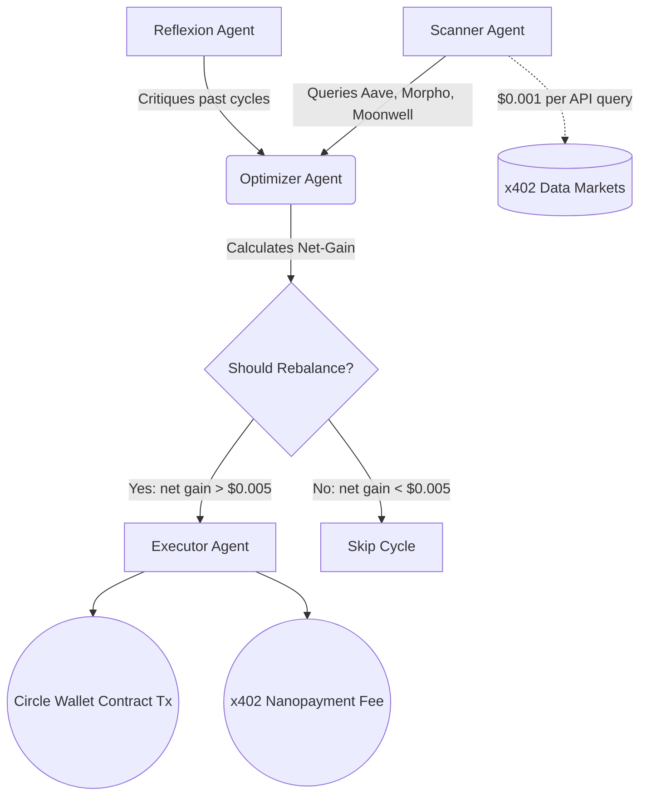

<div align="center">
  
  <h1>ZeltaFi</h1>
  <p><strong>Your Money. Your Keys. An AI That Only Gets Paid When You Do.</strong></p>
  <p>An autonomous DeFi stablecoin yield optimizer powered by Circle x402 Nanopayments on Arc.</p>
</div>

---

## 🏆 Hackathon Submission: Agentic Economy on Arc

ZeltaFi transforms yield farming into a hands-free, institutional-grade experience. Traditional DeFi management requires constant monitoring and expensive L1 gas fees. ZeltaFi solves this by deploying autonomous AI agents that continuously scan Aave, Morpho, and Moonwell, automatically rebalancing your portfolio to capture the highest yield.

**The catch? There isn't one.** 
ZeltaFi uses a strict Net-Gain Guard. The AI only rebalances your funds if the mathematical yield improvement strictly exceeds the cost of the transaction. You never pay a fee unless you make more money.

This gas-free, sub-cent economic model is **impossible on Ethereum** and uniquely enabled by Circle Nanopayments on the Arc Testnet.

---

## 🏗️ Architecture

ZeltaFi uses a multi-agent orchestrated pipeline:



## 🛠️ Tech Stack

| Technology | Purpose |
|------------|---------|
| **Next.js 16 (App Router)** | Full-stack React framework for dashboard and API routes |
| **Tailwind CSS 4** | "Dark Glass" styling, animations, and responsive layout |
| **Circle User-Controlled Wallets** | Self-custody wallet creation and smart contract execution |
| **Circle x402 Nanopayments** | Sub-cent USDC transfers on the Arc Testnet for API queries & fees |
| **Gemini 1.5 Pro/Flash** | AI models for market analysis, optimization, and Reflexion learning |
| **Arc Testnet** | Circle's L1 for gas-free, deterministic settlement |

## 📊 Margin Explanation: Why Arc?

Traditional DeFi yield optimizers die from gas fees. If you have $1,000 deposited, a $10 rebalance fee wipes out weeks of yield.

**ZeltaFi Economics:**
| Operation | ETH Mainnet | Arc + Nanopayments |
|-----------|-------------|-------------------|
| Cost per yield API query | $1–$10 | **$0.001** |
| Cost per rebalance | $5–$50 | **$0.005** |
| 10 queries/hour overhead | $10–$100 | **$0.01** |
| Viable for <$1,000 deposit? | ❌ Never | ✅ **Always** |

With ZeltaFi on Arc, the cost of intelligence drops by 8,000x.

---

## 🚀 Quick Start (Local Development)

### Prerequisites
- [Bun](https://bun.sh) (Recommended for Vercel deployment)
- Circle Developer Account (for API keys)
- Gemini API Key

### 1. Clone & Install
```bash
git clone https://github.com/yourusername/zeltafi.git
cd zeltafi
bun install
```

### 2. Environment Setup
Copy the example env file and add your keys:
```bash
cp .env.example .env.local
```

**Required Circle Entity Secret:**
To generate your `CIRCLE_ENTITY_SECRET`, follow the [Circle Developer documentation](https://developers.circle.com/w3s/docs/developer-controlled-wallets-quickstart). You will need to use the Circle CLI or Python SDK to generate a 32-byte RSA encrypted secret. For this hackathon demo, mock fallbacks are included if the keys are partially invalid.

### 3. Run the App
```bash
bun run dev
```
Navigate to `http://localhost:3000` to view the landing page.

### 4. Seed Demo Transactions
To satisfy the hackathon requirement of 50+ on-chain transactions, run the seeder script. This will execute 20 agent cycles, generating real x402 nanopayments on Arc.
```bash
bun run seed
```

---

## 🎬 Demo Script Instructions

1. Start at the landing page `http://localhost:3000` to show the value prop.
2. Click **Launch App** to enter the Onboarding Flow.
3. Select "Balanced" risk and a $1,000 deposit. Click **Create Wallet**.
4. On the Dashboard, point out the **0 Nanopayments** counter.
5. Click **Run Cycle** and watch the Agent Flow Visualizer light up.
6. Observe the **Live Nanopayments** feed populate with $0.001 yield queries.
7. Show the **Economics Panel** comparing the staggering cost difference between ETH and Arc.

---

## 💡 Circle Developer Feedback

Building with the Circle Web3 Services API was seamless, but we noted two areas for improvement:
1. **Entity Secret Generation:** Requiring an external script to generate the RSA encrypted secret adds friction. A built-in CLI tool or dashboard button to temporarily expose it during testnet would speed up hackathons.
2. **x402 Documentation:** The Gateway Facilitator API docs could use more examples specifically targeting Next.js server actions.

---

<div align="center">
  <p>Built with ❤️ for the Agentic Economy on Arc Hackathon</p>
</div>
